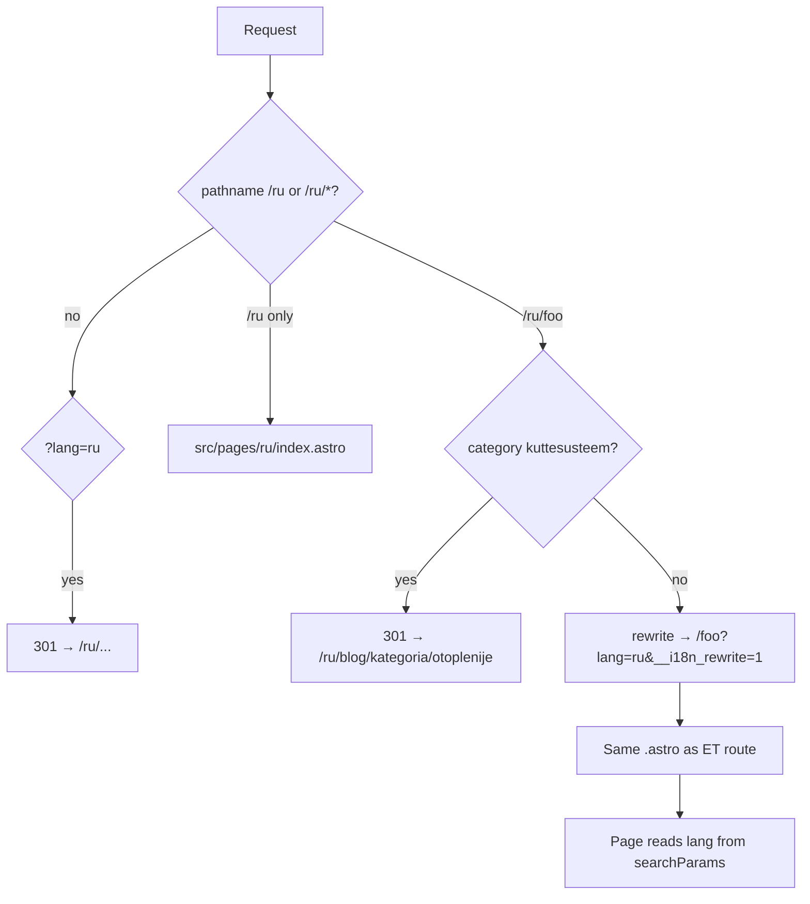

# RU i18n audit — toruabii.ee

**Date:** 2026-05-21  
**Stack:** Astro 5, Cloudflare adapter, `src/middleware.ts` + `data-lang` / `language-switcher.ts`

## Summary

| Metric | Before fixes | After fixes |
|--------|----------------|-------------|
| Sitemap ET routes | 42 (+ `/ru` home entry) | 42 |
| RU routes OK (handler exists) | 42/42 | 42/42 |
| RU routes broken (404 risk) | 0 | 0 |
| Physical pages under `src/pages/ru/` | 1 (`index.astro`) | 1 |
| `npm run build` | failed (syntax in category page) | **pass** |

No ET sitemap URL lacked a page handler. Issues were **wrong home links on RU views**, **canonical bug in BaseLayout**, and **blog category slug/canonical** consistency.

---

## How RU URLs resolve (`middleware.ts`)



| Public URL | Internal handler | `lang` |
|------------|------------------|--------|
| `/ru` | `src/pages/ru/index.astro` | `ru` (prop) |
| `/ru/hinnakiri` | `src/pages/hinnakiri.astro` | `?lang=ru` |
| `/ru/toruabi-lasnamae` | `src/pages/toruabi-lasnamae.astro` | `?lang=ru` |
| `/ru/blog/kategoria/otoplenije` | `blog/kategoria/[category].astro` | `?lang=ru` |
| `/?lang=ru` | — | **301** → `/ru` |

Legacy `?lang=ru` on non-home paths → **301** to `/ru{path}`.

---

## Route table (sitemap → RU)

Run `node scripts/ru-i18n-audit.mjs` to regenerate. All rows: **status OK**.

| ET path | RU path | Handler | Fix applied |
|---------|---------|---------|-------------|
| `/` | `/ru` | `/` + `/ru/index` | — |
| `/ru` | `/ru` (sitemap entry) | `/ru/index` | — |
| `/hinnakiri` | `/ru/hinnakiri` | `/hinnakiri` | `homeHref()` on back link |
| `/faq` | `/ru/faq` | `/faq` | `homeHref()` on back link |
| `/tagasiside-soodus` | `/ru/tagasiside-soodus` | `/tagasiside-soodus` | `homeHref()` |
| `/sitemap` | `/ru/sitemap` | `/sitemap` | RU breadcrumb + category link |
| `/privacy` | `/ru/privacy` | `/privacy` | `homeHref()` |
| `/blog` | `/ru/blog` | `/blog` | `homeHref()` |
| `/blog/*` (14 articles) | `/ru/blog/*` | same slugs | RU titles in frontmatter (existing) |
| `/blog/kategoria/kuttesusteem` | `/ru/blog/kategoria/otoplenije` | `[category]` | 301 ET slug on RU; canonical via `blogCategoryPath()` |
| `/blog/kategoria/otoplenije` | (sitemap RU-only alt) | `[category]` | — |
| `/toruabi-*` (4 services + 5 districts + 10 Harju) | `/ru/toruabi-*` | matching `.astro` | District back links + breadcrumbs; Harju `canonical` |

---

## Russian content

| Area | Status |
|------|--------|
| `language-switcher.ts` `ru` keys | Full set for home, pricing, FAQ, privacy, blog UI |
| `seo-keywords.ts` / page frontmatter | RU titles/descriptions on hinnakiri, faq, services, blog |
| `harju-municipality-landings.ts` | `titleRu`, `heroLeadRu`, `bodyRu`, FAQ RU |
| Tallinn districts | `tallinnDistrictTitle()` etc. |
| Blog index / posts | `titleRu`, `descriptionRu`, dual headers |
| Blog categories | `otoplenije` / `kanalizacija` RU slugs |

---

## Language switcher & header

- **ET page:** `alternateLangPath` → `/ru{path}`; `SiteHeader` `lang="et"`.
- **RU page (rewritten):** switch → strip `/ru`; `lang="ru"`.
- **Home:** `/` ↔ `/ru` only (no `?lang=`).
- Inner nav: `blog-et` / `blog-ru` blocks; visible block from `html[lang]`.

---

## Fixes applied (this audit)

1. **`BaseLayout.astro`** — compute `pageEtPath` before canonical; fix TDZ bug (`etPath` used before define) on rewritten RU pages.
2. **`i18n-paths.ts`** — `homeHref()`, `blogCategoryPath()`, slug maps ET↔RU.
3. **`middleware.ts`** — 301 `/ru/blog/kategoria/kuttesusteem` → `otoplenije`.
4. **Back links** — `homeHref(currentLang)` on hinnakiri, faq, tagasiside, privacy, blog index.
5. **Tallinn districts (5)** — `blog-et` / `blog-ru` back links; RU breadcrumb home → `/ru`.
6. **`sitemap.astro`** — RU breadcrumb URLs; split heating category link.
7. **`blog/kategoria/[category].astro`** — canonical uses RU slug `otoplenije`.
8. **`HarjuMunicipalityToruabi.astro`** — `canonical={pageCanonicalUrl}`.

---

## Build

```bash
npm run build
# ✓ Complete (2026-05-21)
```

Prerender warnings about `Astro.request.headers` on static pages are pre-existing (middleware runs at edge in production).

---

## Maintenance

- Add new ET URLs to `src/data/sitemap-entries.ts`; RU is usually `/ru{path}` unless `ruPath` override (blog categories).
- Run `node scripts/ru-i18n-audit.mjs` after sitemap changes.
- Prefer `homeHref(lang)` or `ruPath()` for internal links on bilingual pages.
